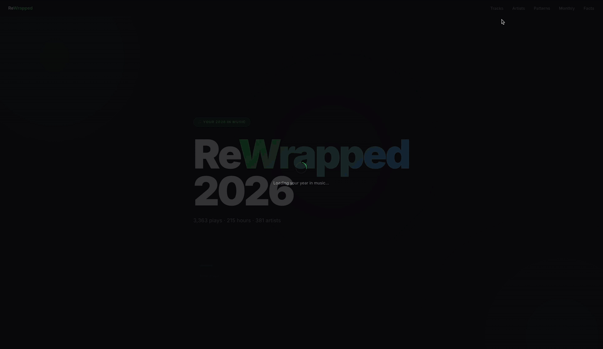

# ReWrapped 2026


A personal Spotify listening stats dashboard.

Pulls data from Google Sheets, enriches it with the Spotify API (album art, artist images, track durations), and renders a fully animated, minimalistic web dashboard.



---

## Features

- **Total stats** — plays, hours listened, unique tracks & artists with animated count-ups
- **Top 10 tracks** — album art, play count, animated progress bars
- **Top 10 artists** — artist photos, genres, ranked cards
- **Listening patterns** — hour-of-day and day-of-week charts
- **Monthly journey** — plays + minutes listened per month, dual-axis chart
- **Genre cloud** — sized by listening weight
- **Fun facts** — first play, peak hour, most active day, discovery rate and more
- Fully static after data generation — no server needed to view

---

## Setup

### 1. Clone the repo

```bash
git clone https://github.com/WilleGyr/ReWrapped.git
cd ReWrapped
```

### 2. Install dependencies

```bash
pip install requests python-dotenv
```

### 3. Configure credentials

```bash
cp .env.example .env
```

Then open `.env` and fill in your values:

```env
SPOTIFY_CLIENT_ID=your_spotify_client_id
SPOTIFY_CLIENT_SECRET=your_spotify_client_secret
SHEET_IDS=your_sheet_id_1,your_sheet_id_2
```

- **Spotify credentials** — create a free app at [developer.spotify.com/dashboard](https://developer.spotify.com/dashboard)
- **Sheet IDs** — the long string in your Google Sheets URL: `docs.google.com/spreadsheets/d/`**`THIS_PART`**`/edit`. Sheets must be set to *Anyone with the link can view*. Comma-separate multiple IDs.

> The script expects each sheet to have a tab named `Blad1` and columns in this order:
> `timestamp | track name | artist | track ID | spotify URL`

### 4. Fetch your data

```bash
python fetch_data.py
```

This generates `data.json` (ignored by git). Takes ~1–2 minutes depending on how many unique tracks and artists need to be fetched from Spotify.

### 5. View the dashboard

Open a local server in the project folder — browsers block `file://` fetches:

```bash
python -m http.server 8080
```

Then go to [http://localhost:8080](http://localhost:8080).

---

## Project structure

```
ReWrapped/
├── fetch_data.py     # Data pipeline — sheets → Spotify API → data.json
├── index.html        # Dashboard (single-file, no build step)
├── .env              # Your credentials (gitignored)
├── .env.example      # Credential template
├── requirements.txt
└── .gitignore
```

---

## Tech stack

- **Python** — data fetching and processing
- **Google Sheets** (public CSV export) — listening history source
- **Spotify Web API** — track durations, album art, artist images & genres
- **Chart.js** — listening pattern and monthly charts
- **Vanilla HTML / CSS / JS** — no framework, no build step

---

## Created by

[William Gyrulf](https://github.com/WilleGyr)

---

## License

[MIT](LICENSE)
